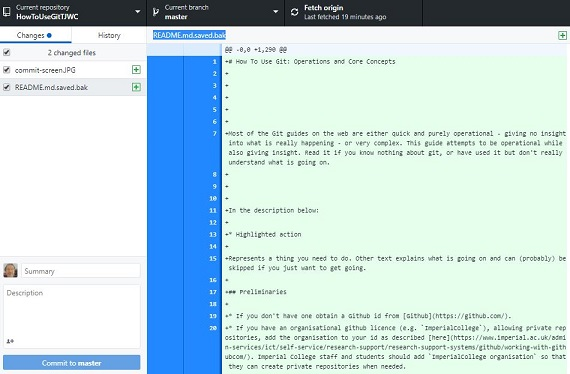
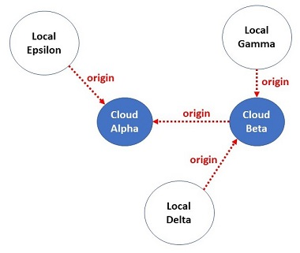
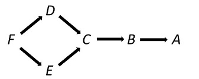

# How To Use Git: Operations and Core Concepts

- [How To Use Git: Operations and Core Concepts](#how-to-use-git--operations-and-core-concepts)
  - [Preliminaries](#preliminaries)
  - [Centralised Workflow: Cloning a Cloud Repository with Write Access](#centralised-workflow--cloning-a-cloud-repository-with-write-access)
    - [Guide](#guide)
    - [How is Git Distributed?](#how-is-git-distributed)
    - [Merging: How Git manages concurrent changes](#merging--how-git-manages-concurrent-changes)
    - [When Automatic Merge Fails](#when-automatic-merge-fails)
    - [Branches](#branches)
      - [Implicit branches](#implicit-branches)
      - [Explicit Branches](#explicit-branches)
  - [Workflows](#workflows)
    - [Centralised Workflow](#centralised-workflow)
    - [Feature Branch Workflow](#feature-branch-workflow)
    - [Forking Workflow.](#forking-workflow)
  - [Useful Git](useful-git)
    - [Git Amend](#git-amend)
    - [Git Reset](#git-reset)
  - [Advanced Git Methods](#advanced-git-methods)
    - [Rebase](#rebase)
    - [Checkout, Revert and Reset](#checkout--revert-and-reset)
  - [Controlling which Files Git Tracks](#controlling-which-files-git-tracks)
    - [Git Staging Area](#git-staging-area)
    - [.gitignore](#gitignore)
  - [Keeping Commit History Clean](#keeping-commit-history-clean)
    - [Git Rebase](#git-rebase)
  - [Glossary](#glossary)


Most of the Git guides on the web are either quick and operational - making what is really happening obscure - or very complex. This guide attempts to be operational while also giving insight. Read it if you know nothing about git, or have used it but don't really understand what is going on. The key principle is to explain the simplest use cases in detail suppressing more complex options in commands.

If you would like a more extensive guide to git I recommend the excellent Atlassian [set of guides](https://www.atlassian.com/git/tutorials).


In the description below:

* Highlighted action

Represents a thing you need to do. Other text explains what is going on and can (probably) be skipped if you just want to get going.

## Preliminaries

* If you don't have one obtain a Github id from [Github](https://github.com/).
* If you have an organisational github licence (e.g. `ImperialCollege`), allowing private repositories, add the organisation to your id as described [here](https://www.imperial.ac.uk/admin-services/ict/self-service/research-support/research-support-systems/github/working-with-githubcom/). Imperial College staff and students should add `ImperialCollege organisation` so that they can create private repositories when needed.
* Before getting started download and install - for your platform - [github desktop](https://desktop.github.com/).
* If you want an operational guide follow [Guide](#guide) below.


## Centralised Workflow: Cloning a Cloud Repository with Write Access

The use case here is when you are part of, or lead, a team using a cloud-based Git (typically Github) central repository (repo). You are expected to **Push** your own commits and manage merges. You will be a project contributor with write access.  This is the simplest Git workflow, but not the usual one. For the usual open source case when you contribute without write access - and somone else **Pulls** your commits - see [Forking Workflow](#forking-workflow). 

For Github best practice, using *branches*, see [here](#github-branches) after you have mastered the simplest workflow. Practically, in many use cases where code is shared, using branches for each individual contribution is a good idea. Once you understand the simplest workflow using branches is no extra effort and has many benefits.

### Guide

Complete copies of project source files, with git history and control, are called **git repositories** (repos). **Github** is one of the many cloud git repository providers, free for public-access projects and commonly used for open source. In order to make contributions to a Github project the *minimum* you need is to **clone the project repo** into a local git repo on your computer.  

This first section uses only the Git _master_ branch: no more is needed to exercise the important parts of Git functionality.

* Go to [Github](https://www.github.com). Use the New Repository button to create a new repository that you can write to. Choose a name. Tick the _initialise this repository with a README_ button. In what follows replace `myrepo` by the name you have chosen.
* Clone your new repo from the Github repo home page. To clone a repository use the _Open in Github Desktop_ option from the *Clone or Download zip* button. Choose a directory: typically something like `C:\users\myid\GitHub` in which the cloned repo (a directory named by default `myrepo`) will be put. Note that there is nothing magic about the location: a Git repo has all control information inside the directory containing the local file copy and it is portable - you can move the directory wherever you like.

You have now set up a **local repo** that is a cloned copy of the remote github repository and uses that as its git origin:

**C:/users/myid/github/myrepo**  ---origin---> **https://github.com/myrepo**

The local repository sets up in your filing system a downloaded copy of the origin repository files which can changed arbitrarily by you. However it contains - invisibly under the hidden `.git` subdirectory - all the necessary git tracking info. It is this info that makes the local file copy itself a git repository.

In fact the local repository you have created consists of TWO LOCAL COPIES of the files:

`C:/users/myid/github/myrepo` (the copy you can see)
`C:/users/myid/github/myrepo/.git` (a hidden *commit tree* copy processed only by git)

The hidden copy is not human editable and must never be touched by you directly. Either command line git tools or (easier for most simple tasks, and used in this Tutorial) Github Desktop will operate on the hidden copy.

The hidden local copy of the project files is stored in a processed form by Git. Initially both it and your visible files will be identical to the remote repo. When you develop new code you change the local files, but the hidden copy is unchanged until you use git commands to record your changes.

<p align="center">
 </img>
</p>

The picture shows how changes are propagated between the central github repository that you created, and your local files: the *working tree*). For now ignore the red arrows, and focus on the blue arrows that represent typical workflow.

Saving your changes - once you have useful new code - is a two-stage process as shown in the left-hand side of the picture:

1. **Commit** to the local repository. Your visible file changes are saved to the hidden (github tracked) files, with a Git tracking message. Git preserves every commit and can backtrack to any point in its history.
2. **Push** the local repository to the remote repository. This propagates the changes, and the newly created commit checkpoint, to the remote repo where they can be picked up by anyone else.

* Keep Github desktop open on your local repository `myrepo` so you can conveniently run git commands from the GUI. It will also periodically Fetch origin/master which is helpful though not necessary.
* Change some local files: e.g. add something to the README.
* View your local repository in Github DeskTop under the `Changes` tab as in the picture below. 
  * The example shows this as I am writing this tutorial
  * Each file changed from the git copy is listed in the LH panel with a tick-box to say whether it will be recorded. By default all tick-boxes are ticked and you should normally keep this.
  * Click on a text file file to view the changes in the RH panel. Changed text is red.
  * Each listed file it is shown as new (green icon) or changed (yellow icon).
  * Also shown in the Github desktop black toolbar are the current repository name, the current _branch_ name, and the _git action button_.

<p align="center">
 </img>
</p>

* Add a short message such as "update README" under `Summary` - this is required -  and press **Commit to master**.
* Note that as result of your Commit the screen changes there are now no changed files. The git action button changes to **Push**.

The Commit DOES NOT UPDATE THE REMOTE REPO, but saves your changes in the hidden local git master copy.


* To update the remote repository, when you are ready and the new code passes tests, press the **Push** action button. This will upload your new Commit to the origin repo.
* Best practice in a code project. Make frequent _local_ repository commits (even of non-working code) so you can backtrack locally. Perform Pushes when your local code is all working. The repository may have a potentially large set of acceptance tests which should be run and passed before pushing to the remote origin/master.
* Normally you make a small change, check it works, and then Push.
* If other people are changing the same origin repo keep Github Desktop open all the time to **Fetch** the remote code regularly. Whenever there are outstanding remote commits the action button will change to **Pull**.  Use **Pull** as described below to reconcile them with your local files ASAP, so that your local tests run with uptodate repo code.

Incorporating changes that other users have pushed to the origin repo is the opposite process (right-hand side of the picture). 

* Before you start make sure all local file changes are Committed and also Pushed.

This is not necessary, and in general not always possible, but it simplifies the walk-through.

* Change the README file in the origin repo using the GitHub edit commands.
* **Fetch** the origin repo using the Github action button. 
* **Pull** the origin repo using the action button again. Fetch and Merge together are implemented as **Pull**.

Pull is not quite identical to Fetch + Merge, but in all normal use cases there is no distinction. So here, Fetch has no more effect having already been done, and Pull will **Merge** the newly fetched files from origin repo into your local working files.


Github desktop is good at keeping your working set synchronised with the origin repo. The action button displays the Git command needed to synchronise safely and provides feedback on status.

For simple use of Git that is all you need, but it can go wrong when multiple people are changing distinct local copies at the same time. That is discovered during Pull or Push. See the section on [when automatic merge fails](#when-automatic-merge-fails)

### How is Git Distributed?

The key to Git's operation is that although shared repositories can have multiple copies there is no way that data can be incorrectly over-written or corrupted. In fact Git data is normally immutable. All commits ever made remain preserved in all repository copies. The only change made to a repository is to add a new commit on top of all historic commits, which remain preserved. Should data in one Git repo copy get corrupted, for example by manually editing the `.git` hidden data, the git SHA-1 CRCs will change and those files (and the corresponding Commit) ignored.

One consequence of this is that when clones of a repository reside on different computers the only difference can be incompleteness. A new commit added to clone A will not propagate to clone B until it is Fetched by B or Pushed by A (assuming A ---origin---> B).

All Git repos contain the same information (when up-to-date) so Git is peer-to-peer. It is often used with a single central cloud repository and others (local or cloud) connected to this via ---origin--> links. But this is for convenience only - and the links can be broken and remade differently if you wish. Any one of the repos alpha - epsilon in the picture contains enough info to reconsitute them all - except for the latest unsynchronised commits. Also, although alpha is the root of the tree of origin connections this is not significant for operation.

<p align="center">
 </img>
</p>


### Merging: How Git manages concurrent changes

Suppose a central repository master branch initially has most recent Commit _C_, and Commit history: _C_ --> _B_ --> _A_. The arrows go from commits to their parents (the previous commit to which they link in the branch history). _C_ is the HEAD of the origin commit history.

Two team members, David and Eddie, make respective Commits _D_ and _E_ on their local cloned copies with origin the central repo:


| repo  |  commit history  |
|-----|----:|
|Central master| _C_ --> _B_ --> _A_|
|David local master | _D_ --> _C_ --> _B_ --> _A_ |
|Eddie local master | _E_ --> _C_ --> _B_ --> _A_ |

The first one of David and Eddie who Pushes to origin will succeed without problem. For example after Eddie Push we have:

| repo  |  commit history  |
|-----|----:|
|Central master| _E_ --> _C_ --> _B_ --> _A_|
| David local master | _D_ --> _C_ --> _B_ --> _A_ |
|Eddie local master | _E_ --> _C_ --> _B_ --> _A_ |


David now cannot Push to central, because that would lead to an origin Commit history with two HEADs, _D_ and _E_. The (usual) solution is to reconcile the changes from _D_ and _E_ in a **Merge** operation, and Push the result. This is all done by David, locally, as follows:

* Commit _D_ (already done by David locally)
* Fetch central (David's local copy is now aware of Eddie's _E_ commit). NB Fetch is normally Done automatically by Pull.
* Pull central. This merges _E_ with _D_ locally - resolving collisions as necessary - creating a new Commit _F_.
* Test _F_ to check it still works
* Push to central: both _E_ and _F_ will be pushed to the central repo creating a diamond-shaped commit history with HEAD _F_ as below. The commit is now allowed because _F_ is a single common HEAD. Note that in Git, because of merges, a commit such as _F_ can have more than one parent.

<p align="center">
 </img>
</p>


This picture leaves out one important detail: the distinction between the HEAD of the local *master* branch of the repo - set to the merge result _F_ - and the *working tree of files* visible to David. The merge operation in the Pull updates local files so that they are the the same as _F_. In fact this is the only way in which local files can ever be updated with remote changes.

### When Automatic Merge Fails

Most of the time when using Git merges happen invisibly, and automatically. Updating local files with new origin/master commits these are first fetched, updating the local origin/master branch, and then automatically merged, updating local files. The two operations are done together with a **Pull** command.

There are two cases where automatic merging is impossible:

1. A file is concurrently deleted and modified
2. The same line of a file is concurrently changed

#### Merge Conflict Walkthrough

* Create a local file `test.txt` with contents as below in your working tree of local repo files.

```
The fox jumped over the dog
```

* Commit it locally.
* Push it to origin, so it has identical copies locally and in origin repo.
* Now make concurrent changes, adding `lazy` before `fox` in local files with a text editor, and `quick` before `dog` in origin files (Github web interface).
* Commit the local change. The origin change, made by editing a file under github, was committed when it was saved.
* Now try to synchronise the two repos with a local Fetch origin and then Pull origin. The Pull will fail, generating a local merge conflict file `test.txt`:

```
<<<<<<< HEAD
The lazy fox jumped over the dog
=======
The fox jumped over the quick dog
>>>>>>> 997ef886cab58a8faed628310180757c9e977389

```

Git creates a local file like this for each working tree file with such a conflict. This contains its normal contents with markers identifying conflicting lines in the diff between the two commits and an SHA-1 stamp to identify the commit being merged. 

A set of working tree files with conflict(s) are like those generated in the  _F_ commit, but unfinished because not yet known consistent with both _D_ and _E_. Call them _F'_.  _F'_ is known as a _merge conflict_.

Merge conflicts can be _resolved_ locally by editing the local working files containing the conflict markers - deleting the markers - and keeping the desired edits. In this case we change the working file tree to _F''_ by manually changing the local `test.txt` to incorporate both _E_ and _D_ changes, and deleting the conflict markers:


```
The lazy fox jumped over the quick dog
```


After that, a merge Commit will add _F''_ to the commit history with both _E_ and _D_ as immediate ancestors as in the automatic case. A Push after this will succeed and propagate the updated file to origin.

For more info see the [github information](https://help.github.com/articles/resolving-a-merge-conflict-using-the-command-line/)


### Branches

A git **branch** represents a complete history of the working file tree as a sequence of commits each containing a snapshot of file contents. The branch is identified by its HEAD commit, this links to the complete commit History. Typically a project's code will be on the _master_ branch. Any number of named other branches may coexist with the master branch. All of the Git operations you have learnt can be done, independently, on any branch. Changing a branch has no effect on any other branch, all branches are independent.

#### Implicit branches

Thus far all work is done on the master (main) branch of the repo. However there are in fact three separate versions of this:

* The origin/master in the central repo
* The local `origin/master`. This must be must be consistent with `origin/master`, but may have fewer commits, if a central commit has been added after the most recent Fetch.
* The local repo `master` branch. This may have local commits not yet Pushed to origin/master.

Git uses these versions as described above to synchronise code through Push or Pull and Merge. In the local repo `master` and `origin\master` are different branches, although only used internally by Git.

#### Explicit Branches

A repo (remote or local) can also contain any number of named branches. Each branch has its own separate commit history HEAD. In the above examples only the **master branch** is used. New branches can be created, typically for new features, or to allow independent code development without having to pull in remote changes. When you operate on code this is always in a specific branch. Creating your own private branch and using this means there is no problem with conflicts - you are the only person changing that branch. However merging the branch back into the master copy (if this is needed) requires all conflicts - typically a lot - to be resolved.

Therefore good practice when using branches that you expect _eventually_ to be merged back is to update your branch regularly with the latest master commits. That way you are not likely to get conf;licts with other changes.

To create a named branch that is a copy of the current master:

* In Github Desktop `Branch-> New Branch`. Give your name branch a nmae e.g `mybranch`. After creating the branch Github desktop will switch to tracking the new branch. You can change this at any time. 

The new branch can be fetched or pulled from the origin just like master. Unlike master, it is not likely that anyone else will make Commits to it - although anyone with write access to the origin repo could do so. Branches allow each developer to have separate code on top of a common base, with the ability to merge changes back to the common code when they reach a suiatble state.

## Workflows

### Centralised Workflow

This is the workflow discussed above. Developer Jane clones the origin cloud repo and makes commits locally. Whenever satisfied the project is in a working state Jane pushes them to the origin. Changes in origin from other developers get pulled by Jane.

* Never push to cloud until local code passes tests
* Fetch/Pull often to make sure new code works with most recent commit of origin.

Atlassian has a good [detailed description](https://www.atlassian.com/git/tutorials/comparing-workflows#centralized-workflow) with typical use cases.

### Feature Branch Workflow

This is as above, but the local work is on a branch of the origin repo used only by Jane. Pushing to the origin can be done at any time without affecting the master production code. When the new code has reached a good state a Merge can be done as follows

* Push Branch to origin
* Go to origin (Github) repo
* Note the option on Github repo to Pull Jane's branch
* Submit a Pull Request & complete the Merge on Github
* Now origin master has been updated with all the changes from Jane's branch and the branch is identical to the master copy.
* Now the branch can be deleted, or kept and used for more temporarily private changes.

Alternative method for merging Jane's Branch to the origin master:

* Jane Fetches origin
* Jane goes back to master branch on her local repo
* Jane merges her branch locally into her master
* Jane pushes her master to origin

**Note about branches**. It is very convenient to use branches when refactoring code, because locally you can at any time switch between master (before refactoring) and the current version you are refactoring. That deals with the _help I can't remember what this was before I mucked it up_ problem. you can do this without branches - by reverting to a previous commit - but this is more work.

See also Atlassian [description](https://www.atlassian.com/git/tutorials/comparing-workflows/feature-branch-workflow) on this workflow.

### Forking Workflow.

As above but fork the origin cloud repo to your own cloud Github repo. Then clone this to the local (working) repo. That allows each collaborator to have their own private cloud repo for their branch and is commonly used for open source projects. See also Atlassian [description](https://www.atlassian.com/git/tutorials/comparing-workflows/forking-workflow).

This workflow is typically used contributing to open source projects. It is more complex than contributing to a team project because contributors do not have write access to the central repo, nor are necessarily trusted. Therefore they cannot **Push** their commits. Instead one of the repo core contributer team (who do have write access) will **Pull** your commits - checking that they are OK.

Why does this make things more complex? In order for your commits to be Pulled they must reside in a cloud-based repository - not your local working copy. Therefore one extra clone of the repository must be made by you as illustrated below.

**local repo** ---origin (clone)---> **your github repo** ---origin (fork)---> **open source github repo**

The recommended way to do this is by first **Forking** the open source repo, creating a new branch as your own Github repo. 

* Navigate to the open source github home page. Click the top righthand **Fork** button and create your own github fork of the project.

This is no different from cloning except that your copy of the repo has a different name. The forked copy can then be cloned locally as in the first part of this tutorial.

* Follow steps [above](#cloning-a-cloud-repository-with-write-access) to create your local working copy
* Use the same workflow as before. When **Fetching**, your fork and you local files will be updated on Github from the central repo. When **Pushing**, your fork will be updated on Github from your local changes
* You can submit a **Pull Request** to the open source repo team to pull the changes from your fork back onto the central open source repo.


## Useful Git

### Git Amend

Suppose you have made a _local_ commit and suddenly realise you forgot something. Instead of doing another commit, you can do a `commit --amend` that will change the most recent commit adding your new changes to it.

This is safe and a great idea to reduce the number of useless commits. One restriction is that it will not work once you have Pushed a commit outside your local repo.

You can use Git command line tools, or Git GUI to implement `git --amend`. Git GUI is similar to GitHub GUI but not recommended for normal use because it exposes the confusing _staging area_. However it allows a larger set of advanced git commands with some GUI help. 

To use `Git GUI` to make an amend:

* start Git GUI and open your local repo
* click in Git GUI
  * Stage changed
  * Amend Last Commit
  * Commit

`Git --amend` is recommended.

### Git Reset

Sometimes you want to abandon unsaved changes in working files and return to the last commit. The command here is `git reset --hard` which will need to be executed from a command line. This command permanently deletes any unsaved changes, so be careful.

## Advanced Git Methods

### Rebase

The 'standard' Merge operation makes diamonds in repo commit history. There is an alternative you can use called `merge rebase` that keeps the commit history linear by incorporating the origin commits into your local branch _first_, and then making your new (merged) commit on top of the most recent origin commit. Rebase can be used either with merge, or on its own. It can be helpful but there is a Golden Rule: never rebase a branch others can be using. An accessible and long discussion of when to rebase in a merge, with diagrams, is [here](https://hackernoon.com/git-merge-vs-rebase-whats-the-diff-76413c117333).


### Revert, Checkout, and Reset

These commands allow _time travelling_ the commit history in different ways.

#### How to specify a past commit on the current branch

Git revert, checkout, and reset all operate on some commit in the command history and default to the most recent one. Revert can be used from Git Desktop so it is [easy](#revert) to specify the commit it operates on. For command line operation (reset and checkout) the commit can be specified as the 7 digit commit hash `git reset --hard 5eb790b`. You can find this from any Git history viewer. In Git Desktop:


* Go to History tab. click on the commit you want.
* Look for 7 digit string at top of Git Desktop above the list of changed files.

There are other ways to specify commit, e.g. `HEAD~n` means the commit n commits away from the current HEAD (this may not be unique, if there have been merges, in which case the 1st of the matching commits is used). In a linear commit history `HEAD~n` is an unambiguous way to select a past commit.

For example:

* Commit History: C --> B --> A
* Most recent commit is C, and this is also the HEAD of the current branch.

| Commit | Notation | SHA1 |
|----------|------|
| C | `HEAD` | `7facb601` |
| B | `HEAD~1` | `ab35c21` |
| A | `HEAD~2` | `9f2aa3d` |


#### Revert

A Git **revert** (from Github desktop -> history tab -> _select commit to revert_ -> revert) adds a new commit to undo _just one previous commit_. If applied to the most recent (HEAD) commit it undoes what you last committed. Otherwise it selectively undoes the changes in the reverted commit while leaving all subsequent changes. Revert adds a new commit to the commit history and changes the working files. It does _not_ remove the reverted commit from the commit history.

If the reverted changes cannot be disambiguated from some other change, for example because the same line of a file has been altered in the two changes, then a collision file is created just as for a failing merge, instead of a commit. This can be edited manually and then committed.

Revert is relatively harmless because it adds to the commit history like other standard git commands and therefore cannot permanently lose anything.

#### Checkout

Both Reset and Checkout need command line (or a more complex GUI than the simple Github Desktop). Both commands have a number of uses: this description focuses on use to get back to an earlier commit. More general information from [Atlassian](https://www.atlassian.com/git/tutorials/undoing-changes).

A Git **checkout** (command line `git checkout`) is typically used to change the current branch, and harmless. However when given a previous commit (e.g. command line `git checkout HEAD~n` it creates a new HEAD to point to the given commit, and adjusts the local working files to be what they were after that commit. This puts the repo into an unpleasant `detached HEAD` state where future commits cannot be reconciled with the previous branch. 

That can be simply mended by creating a new branch starting with the detached head and including all of its history. 

* Github desktop-> branch-> new branch -> specify a name


Thus the typical workflow using `git checkout <some commit>` would be:

* navigate to current repo on command line
* `git checkout HEAD~3` : go back 3 commits
* (from Github desktop) branch -> new branch -> old state
* (from Github desktop) current branch -> master

This will create a new branch named `old state` with historic files that can be switched to like any other branch, and (probably) deleted when no longer needed.

You cannot (surprisingly) use `git checkout HEAD` to restore the working files after the most recent commit. In that case the working files don't change, however the repo still enters detached head state.

`git checkout <some commit>` can thus be used safely to view, or with extra work operate on, files at some earlier state. 

Git checkout is dangerous in the sense that it loses uncommited file changes, and it puts the local repo into a surprising state (detached HEAD) that needs to be got out of.


#### Reset

Git reset makes _dangerous changes_ that cannot be undone and are only allowed for local commits - ones that have never been Pushed and therefore do not exist in any other repo.

When [used without a commit](#git-reset) `git reset --hard` abandons unsaved chnages in teh working tree.

When given a previous commit `git reset --hard <past commit>` will reset current branch history and files to the given commit. The changes after the reset point are lost to the current branch, and since reset is only allowed for commits that have not been Pushed these changes are lost forever. (Technically they still can be retrieved from the commit SHA-1 hashes but this is a lot of work).

You may want to go back much further, past a commit that has been pushed. You cannot do that with `reset`, but you can do it with `checkout` followed by `create new branch`, as above. Getting the master branch back to something like the earlier state would then be possible, but require a merge of the new branch with master.

What if you just want a _new_ commit on master that roles files back to an exact historic state from say commit `HEAD~20`? That cannot be done with reset. You could (in principle) copy files manually from a `HEAD~20` based branch made by checkout). There is another solution to the problem. Apply revert 20 times to revert every one of the last 20 commits, starting with the most recent!

Note the difference between `reset` and `checkout`. Both move back to a previous state but `reset` changes the current branch to that state whereas `checkout` leaves the current branch safe and creates a new detached HEAD branch to do the time-travelling. Thus `checkout` goes back in time and allows return to the present, whereas `reset` goes back in time with no return, and is limited in how far it can go.

#### Deleting all past commit history

Suppose you want to remove the git commit history from a project but keep the files. How do you do this? Remember to keep a backup repo with the old history, because this is dangerous...

```
git checkout --orphan newBranch     # create a new branch with no history
git add -A                 # Add all files and commit them
git commit
git branch -D master       # Deletes the master branch
git branch -m master       # Rename newBranch to master
git push -f origin master  # Force push master branch to github
git gc --aggressive --prune=all     # remove the old files
```

#### Warning

In general `git reset` and `git checkout` commands have many options and can do other things: beware of this when using them since it is easy to get them wrong. Above is the case where they operate on the current (active) branch to roll back commits.

You may want to use some more powerful GUI than Github desktop to use these commands, however my advice would be not to do so. Github desktop is limited in functionality but easy to use and bomb-proof. I recommend it for most day to day use. For anything more advanced you need to be using git with a command line and understanding more what you are doing.


## Controlling which Files Git Tracks

### Git Staging Area

Many Git guides will mention the _git staging area_. This guide does not consider this, nor is it necessary if you use Github desktop. The staging area is a confusing concept because it is often described as a 3rd set of files; in between the working tree and the commit tree. Using Git is then a two-stage process of first staging and then committing files.

This is innaccurate. Git keeps track by name in an _index_ of which files you want recorded in Git. Files not in the index are not saved by a Git commit. The default workflow using Github desktop will index all files (the tick-boxes under `Changes`). This is what you want. When files or directories should not be recorded, for example binaries and temporary files, this is managed globally through a `.gitignore` file in your repo.

Advanced git users can make use of staging by unticking some files for a specific commit so that they are ignored. This is not recommended. Command line use of git requires two commands `git add` followed by `git commit` to track a new file, unless `git commit --all` is used which automatically does the add. The workflows here are all equivalent to using `git commit --all` all the time.

### .gitignore

Git local files can optionally include a visible text file `./.gitignore`. This specified what files extensions are excluded from Git. Directories and subdirectories can also be excluded. A programming project will often use a (large) `.gitignore` tuned to the specific platform and language used so that only relevant source files, and not loader and compiler generated binaries, are recorded in Git. This is important when binay sizes are large, and good practice anyway. See the [git documentation](https://git-scm.com/docs/gitignore) or add a `.gitignore` from a skeleton project.


## Keeping Commit History Clean

For more extended information on this topic see [notion.so](https://www.notion.so/Keeping-Commit-Histories-Clean-0f717c4e802c4a0ebd852cf9337ce5d2).

Ideally the repo commit history should have only significant commits, each with informative messages, making exploring past state code easy. In practice this gets polluted by a whole load of bug fixes, afterthoughts, etc.

Two useful commands for retrospectively cleaning things up are `amend` (described [above](git-amend) and `rebase`.

### Git Rebase

We looked above at `merge rebase`. A distinct use of rebase (and a different command) is in [cleaning up commit history](http://www.siliconfidential.com/articles/15-seconds-to-cleaner-git-history/).

This can be used safely to remove local commits that mean little and push a single clean commit to origin. If you have multiple developers working on your project, with their own local copies of history, removing historic pushed commits will give you real pain. If however you are the only developer it is still OK. You can do it locally and use `git push -f` to force the local changes to origin.

The preferred way to use rebase is as follows:

* `git rebase -i <somecommit>`
An editor will open up with a list of all the ommits to be rebased and instructions
* change each line as specified to process that commit
* Exit the editor
* Rebase will process the edited file and finish.

One radical solution (to remove pushed history) is to copy the repo to a new repo leaving out the earlier part of the history using a [graft](https://git.wiki.kernel.org/index.php/GraftPoint). That is not supported here. Also see [the alternative strategy](deleting-all-past-history) creating a new orphan branch and renaming it master that deletes all history.

## Glossary

In the table below repo B has `origin` repo A. Operations are done by B. We have:

* B working files (BF)
* B Git Files (BG)
* A Git Files (A)

BG and AG represent logically the same (master) branch so over time will stay in sync, however temporarily one or other can be ahead with commits not yet propagated.

We don't need to consider A working files (for example, A could be a cloud repo with nothing except the Git files).

| Term| Meaning |What <br> changes|
|------------|-----------------|-----|
| Fetch | Copy new A commits to BG | BG |
| Automatic Merge | Copy new A commits to BF  | BF |
| Merge (with conflict) | Update BF with A and conflict markers | BF |
| Resolve conflict | Delete conflict markers, <br> manually correcting conflicted lines | BF |
| Commit (after Merge conflict) | Update BG with BF | BG |
| Pull | Fetch then Merge | BG and BF |
| Automatic Push | Copy new BG commits to A <br> Will fail if A has new commits | A |
| Push (with conflict) | Fails | No change: see note below |
| Staging area | Terminology not used here, see [below](#git-staging-area) | n/a |
| origin | repo to which a cloned or forked repo is connected | n/a |
| Working tree | set of all local files in repo | n/a |
| Commit tree | copy of all local files from last Commit stored by Git |
| HEAD | The HEAD of a branch points to the most recent commit in a branch | n/a |

Push conflicts are caused by commits to A that cannot be automatically be resolved with the Pushed B commits (analogous to a Merge conflict). The solution is to resolve the conflict manually as a Merge conflict on B:

* Fetch
* Merge (with conflict)
* Commit (after merge conflict)
* Push (will now succeed)

